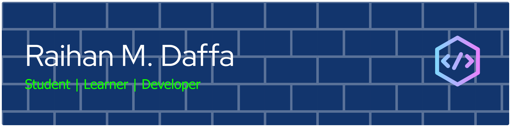

## Hi there 👋! I'm...

<!--
**rinmdfa25/rinmdfa25** is a ✨ _special_ ✨ repository because its `README.md` (this file) appears on your GitHub profile.

Here are some ideas to get you started:

- 🔭 I’m currently working on ...
- 🌱 I’m currently learning ...
- 👯 I’m looking to collaborate on ...
- 🤔 I’m looking for help with ...
- 💬 Ask me about ...
- 📫 How to reach me: ...
- 😄 Pronouns: ...
- ⚡ Fun fact: ...
-->

- 🔭 I’m an **Undergraduate Information and System Technology student**
- 🌱 I’m currently learning [**NextJS**](https://nextjs.org/) framework
- 😄 Pronouns: **Daffa/Rin**
- ⚡ Fun fact: I love CGDCT Animes

### Tech Stacks

#### Programming Language

   

#### Website Development

    

#### Mobile Development

  

#### Machine Learning Development

    

#### Integrated System Development

  

#### Databases

  

#### Others

  

### Projects

### Get in Touch

    

### Stats

